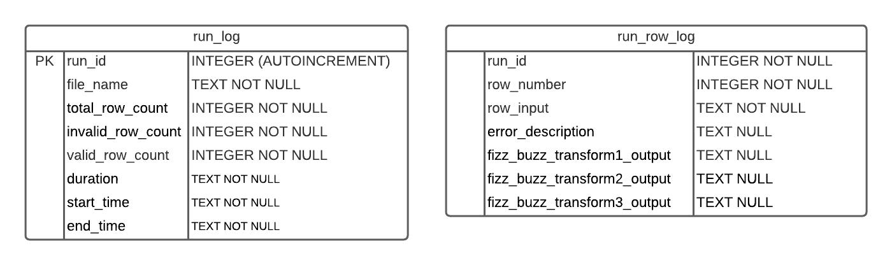

# Real FizzBuzz Solution

This solution was written in Python 3.9 and solves the Real FizzBuzz challange. The results of the program are stored in a Sqlite DB with the following table structure


## Table Structure



## Running the program
Running the solution is as simple as `python fizzbuzz.py`.   By default this will process the `test_values.csv` file in the ./data directory.  Optional paramaters are as follows

```
-f --Filename  Can pass in different filenames for processing
   python fizzbuzz.py -f ./data/test_values2.csv
   python fizzbuzz.py -f C:\temp\test_values3.csv
```

## Running the tests
Unit test can be run by using the following command 
```
python test_fizzbuzz.py
```